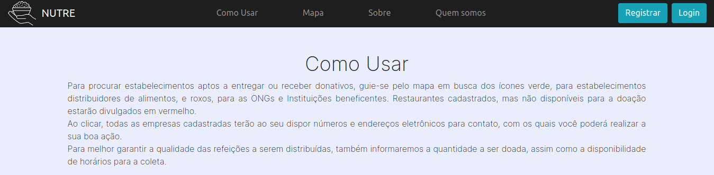
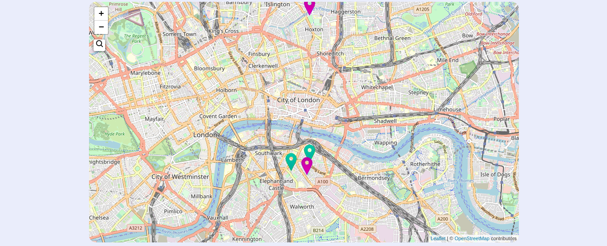
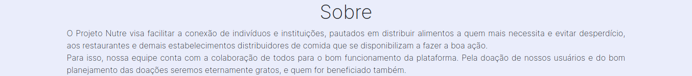
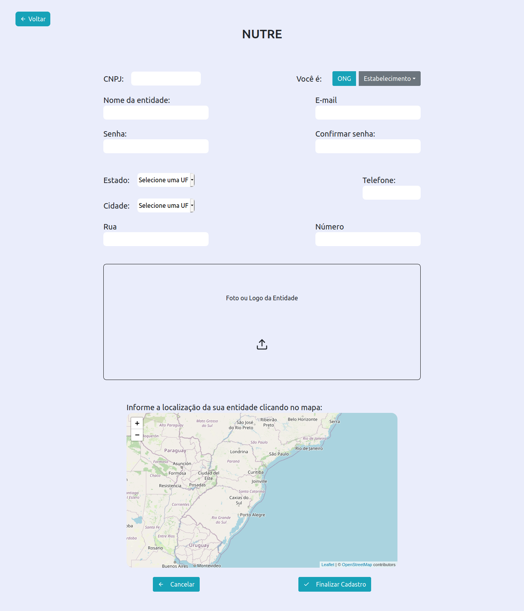

# NUTRE

Nesse repositório se encontra o código do frontend e do backend da aplicação. No front utilizamos ReactJS e o backend foi desenvolvido com Node.JS utilizando Express como framework web, Knex como query builder e sqlite3 como banco de dados.

## Backend
Para instalar as dependências do projeto navegue até a pasta `server` e execute o comando `npm install` ou `yarn`.

Para configurar o banco de dados, primeiramente execute o comando ```knex migrate:latest``` se você está usando o npm ou ```yarn knex migrate:latest``` com yarn. Isso criará as tabelas no banco de dados. Para populá-las com dados de exemplo execute o comando ```knex seed:run``` ou ```yarn knex seed:run``` no yarn. 

Após isso, apenas rode um ```npm start``` ou ```yarn start``` para iniciar o servidor. O servidor HTTP irá iniciar na porta 3333.

### Arquitetura e Uso
O servidor do Express utiliza-se das rotas definidas no arquivo ```routes.js``` para decidir para onde irá cada requisição, baseado em sua URL. Para cada uma, uma diferente função de *callback* dos controladores é invocada. São dois controladores, ```EstablishmentController.js``` e ```NgoController.js```, que se encontram na pasta ```controllers```.<br><br>
Por exemplo, quando o usuário cria uma solicitação para a aplicação usando a rota ```/ngo/3``` o Express chama a função de ```ngoController.get``` do ```ngoController```. Esta recebe como parâmetro a requisição e usa o ```id``` dos parâmetros da *query* para buscar no banco de dados (usando o *Knex*) a ONG com aquela ```id```. Após isso, a função usa o objeto resposta também recebido como parâmetro para responder para o front-end os dados referentes àquela ONG.<br><br>
As outras rotas funcionam de forma semelhante. Para testagem das mesmas recomenda-se utilizar o software *Insomnia*, que foi o utilizado durante o desenvolvimento dessa aplicação.

### Consistência de Dados - CronJob
Em nossa solução precisamos que os estabelecimentos disponibilizem doações por um determinado intervalo de tempo. Para garantir que não tenhamos problemas com isso criamos um cronjob (isto é, uma tarefa que será executada periodicamente de forma automática) no arquivo ```src/server.js``` que, utilizando a biblioteca ```node-cron```, executa a função definida em ```src/database/jobs/clearDonations.js```  que é responsável por verificar a cada determinado intervalo de tempo se a doação já expirou e, caso isso já tenha acontecido, atualizar o banco de dados para evitar que pessoas desperdicem esforços indo atrás de alimentos que não estejam mais disponíveis. Atualmente o intervalo de tempo foi configurado para 3 minutos, mas isso é facilmente modificado no ```server.js```.

## Frontend
Para instalar as dependências do projeto navegue até a pasta `frontend` e execute o comando `npm install` ou `yarn`.

Para executar o site basta rodar o comando ```npm start``` ou ```yarn start``` e o React iniciará um novo servidor rodando na porta 3000 de sua máquina, além de abrir o projeto em uma nova aba de seu navegador

### Landing page
Ao entrar no site a primeira coisa que pode ser notada é uma explicação sobre como usá-lo, da perspectiva do usuário final, sejam eles empresários ou responsáveis por ONGs:



E após isso um mapa construído utilizando Leaflet JS contendo informações sobre os estabelecimentos e ONGs parceiros da solução (atualmente as informações são fictícias). As localizações em roxo são ONGs cadastradas, as em vermelho são estabelecimentos cadastros que no momento não tem alimentos disponíveis para doação e os em verde estão dispostos a ajudar ONGs que possam ir lá coletar os alimentos:



Na seção Sobre há uma breve explicação sobre o projeto Nutre:



e ao fim da página, na seção Quem Somos, uma introdução da equipe:


### Registro
A seção de registro permite que novos estabelecimentos parceiros e novas ONGs inscrevam-se na plataforma e assim suas localizações apareçam para coleta de alimentos. É necessário preencher todos os campos do cadastro para que ele seja efetivado.


